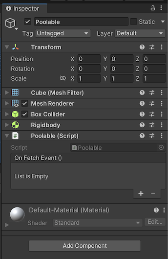
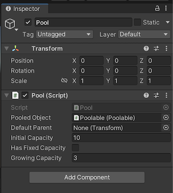

# Unity-Pools

Unity3d package allowing to pool frequently used GameObjects.

Feedback is welcome.

## Plug and Play
1. Open "Package Manager"
2. Choose "Add package from git URL..."
3. Use the HTTPS URL of this repository:
   `https://github.com/yanicksenn/unity-pools.git`
4. Click "Add"

## Usage

- [Poolable](#user-content-poolable)
- [Pool](#user-content-pool)
- [Fetching](#user-content-fetching)
- [Instantiation](#user-content-instantiation)

### Creating Poolable

Assign the `Poolable` component to the `GameObject` that should be pooled.



Configuring the `OnFetchEvent` allows to listen and handle whenever an instance of this poolable is fetched from a `Pool`. 

### Creating Pool

Assign the `Pool` component to the `GameObject` that should manage all instances.



Reference the `GameObject` with the `Poolable` component within the `Pooled Object` field and set the `Initial Capacity` to a desired number.

### Fetching

It is possible fetch instances from the `Pool` with the `Fetch()` method. It is possible to fetch as many instances as needed as long as the flag `Has Fixed Capacity` is not checked (Checking the flag prevents the creation of new instances when at capacity).

Instances that are no longer needed can made available again by deactivating the `GameObject` (`gameObject.SetActive(false)`). 

```c#
public class MyGun : MonoBehaviour
{
    [SerializeField]
    private Pool myBullets;
    
    [SerializeField]
    private Transform myBore;
    
    public void Shoot() 
    {
        var instance = myPool.Fetch();
        instance.transform.position = myBore.transform.position;
        instance.transform.rotation = myBore.transform.rotation;
    }
}
```

The instances will be created in the scene root (no parent). It is possible to change the default parent by specifying a transform in the `Default Parent` field.

### Instantiation

If a pool is allowed to grow and has no available instances an additional instance will be created. Therefore the pool capacity is increased by one. Sometimes it makes sense to additionally create a few more instance when growing. This can be accomplished by specifying the additional amount in the `Growing Capacity` field.